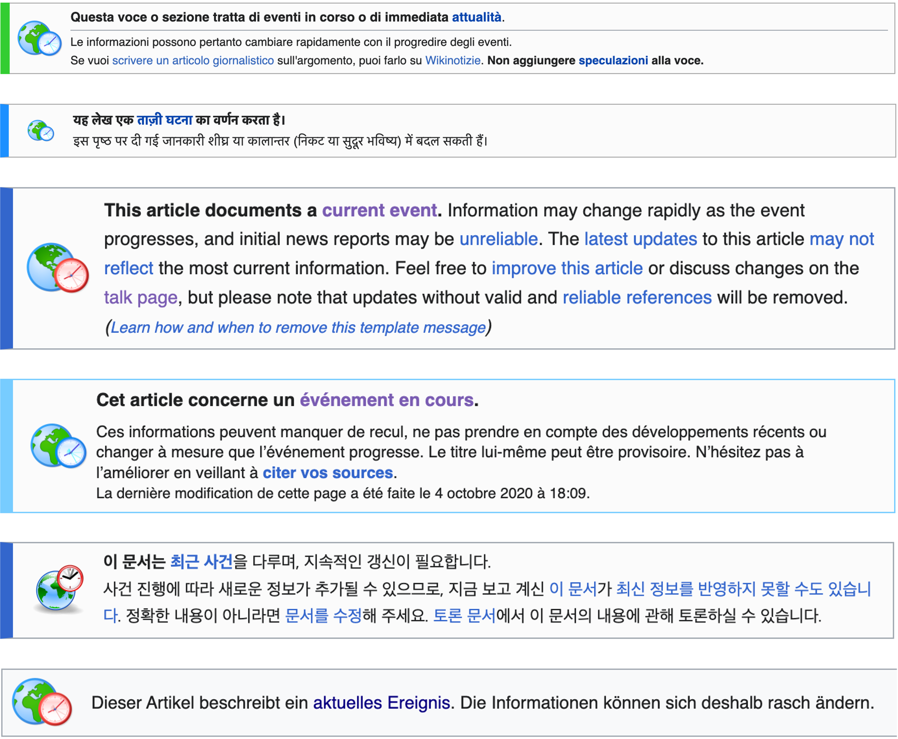

```{r setup, include=FALSE}
knitr::opts_chunk$set(echo = FALSE, out.width = "100%")

library(tidyverse)
```

# Introduction: Wikipedia and The Technicity of Time

Time is a supple medium. It winds itself into many shapes. It surges through the heartwood. It lies upon the bark. It carves rock and unfolds in song. It creates myriad structures, then entropically destroys them. It races, dallies, recurs, reverses, accelerates, splits and stops.

Despite its suppleness, time has definite characteristics. It forms rhythms. It weaves people and plants and animals into lives and seasons. It founds eras.

What are the characteristics of time in the digital era? The question has been a major preoccupation for humanists and social scientists in the twenty-first century. Theorists in many disciplines have argued that 'presentism' is the dominant 'temporal regime' of the twenty-first century [@assmann_is_2020; @hartog_regimes_2017]. We inhabit a 'broad present' [@gumbrecht_our_2014] or a 'timeless time' [@castells_rise_2010] in which big data and frictionless communication have conspired with the cult of memory to abolish the future and bring the past into the present. We live in a rubble-world of accumulating fact. Other theorists have diagnosed the problem as 'temporal acceleration'. We experience time as running ever faster, argues @wajcman_pressed_2015 [p. 77], because it has become 'deroutinized'. We are trapped in the present because we are present in so many places at once: on the phone to daycare while picking up dinner ingredients in the supermarket on our lunchbreak at work. Digital media are the handmaidens of post-industrial capitalism. Without them, we would be unable to maintain the modicum of order we currently enjoy.

A weakness of many theories of temporality is their focus on the *products* rather than the *production* of temporal regimes. To characterise a temporal regime, the theorist considers some cultural products, such as literary texts [@gumbrecht_our_2014; @hartog_regimes_2017] or work-time statistics [@castells_rise_2010] and tries to determine what kind of temporal regime those products represent. Such accounts necessarily raise the question: how is it possible to erect a temporal regime in the first place? A compelling answer is given by @orlikowski_its_2002, who argue that the temporal regime of an organisation is produced by the 'practices' of its members. Such practices can modify a temporal regime 'implicitly' or 'explicitly' [-@orlikowski_its_2002, p. 687], though in either case the key force of change is *repetition*, or 'recurrent action' [-@orlikowski_its_2002, p. 696]. Temporal regimes are rhythmical. They are produced by the recurrent actions of people, who learn to act in concert as the members of an orchestra.

In this paper, we build on Orlikowski and Yates's theory of temporal structuration to describe the temporal regime of Wikipedia. We show that to explain Wikipedia's temporal regime, it is necessary to supplement Orlikowski and Yates's theory of *repetition* with a theory of time's *representation* and its *technicity*. Only by accounting for these three aspects of time can we adequately answer our central questions: (1) what is Wikipedia time? and (2) what can it tell us about digital time more broadly?

Our central case study is [Yapperbot/uncurrenter](https://en.wikipedia.org/wiki/User:Yapperbot), a 'bot' or computer program that polices the barrier between past and present on English Wikipedia. We situate Yapperbot/uncurrenter in Wikipedia's broader sociotechnical systems. We examine how it interacts with human editors. We show how it fits into Wikipedia's complex array of interfaces and data streams. We present Yapperbot/uncurrenter as a prime example of the 'technicity of time'. It is a technology that attempts to make time concrete, to freeze it into an object. Yapperbot/uncurrenter is like the master's clock in an eighteenth-century factory. It ticks regularly (*repetition*), shows the time (*representation*) and acts impersonally (*technicity*).

Yapperbot/uncurrenter performs a single, simple task. Each hour, it scans English Wikipedia, finding every article that 'transcludes'  [Template:Current](https://en.wikipedia.org/wiki/Template:Current). If the article has not been edited in over five hours, it deletes the template.

A 'template' is a microprogram that peforms a common task. In the case of Template:Current, the editor inserts the code `{{current}}` into an article. This adds a warning banner to the article (Figure \ref{fig:banner_collage}), and automatically adds the article to [Category:Current_events](https://en.wikipedia.org/wiki/Category:Current_events). When Yapperbot/uncurrenter deletes the template, the banner disappears, as does the article's categorisation as a 'current event'. This would seem to consign the article to the past. But here lies the first twist in the tale. When Yapperbot/uncurrenter deletes Template:Current, it leaves an oddly contradictory message in the article's edit history:

> Auto-removing {{current}} - no edits in 5hrs+. The event may still be current, but [the {{current}} template is designed only for articles which many editors are editing, and is usually up for less than a day](https://en.wikipedia.org/wiki/Template:Current).

On English Wikipedia, an event can be 'current' without being `{{current}}`. This contradiction lies at the heart of Wikipedia's temporal regime. When Wikipedia's English editors debated the need for Yapperbot/uncurrenter, they ran straight into the contradiction between two different understandings of time. To stabilise Wikipedia's temporal regime, they had to resolve this contradiction. As we show below, Wikipedia's English editors made the radical move to try and abolish the present, a path that editors of other-language Wikipedias have refused to take.

```{r, echo=FALSE, fig.cap="Template:Current in Italian, Hindi, English, French, Korean and German (as of 14 March 2023)\\label{fig:banner_collage}"}

```

Wikipedia is one of the few places where where the construction of a temporal regime can be (almost) directly observed. Unlike other prominent social media platforms, Wikipedia is an 'open' project, every one of whose facets can be publicly altered and debated. The encyclopaedia can only be changed in public. Nearly every step in the construction of the temporal regime leaves an easily-recovered mark. It may appear that an 'open' platform such as Wikipedia could never tolerate something as closed as a temporal *regime*, but as @tkacz_wikipedia_2015 shows, Wikipedia's openness has not prevented it from developing a restrictive 'frame' of rules and concepts that govern its activities. Quite the contrary. Wikipedia is not only the most open of social networks—it is surely also the most highly organised.

Wikipedia is also a place where 'technicities of time' are especially prominent. Large parts of the encyclopedia are managed by bots such as Yapperbot/uncurrenter, which are powerful actors in Wikipedia's sociotechnical system [@niederer_wisdom_2010; @dijck_culture_2013, pp. 137-140; @geiger_work_2010; @geiger_when_2013; @tkacz_wikipedia_2015, pp. 111-119; @geiger_operationalizing_2017; @halfaker_bots_2012; @livingstone_population_2016]. Bots are best understand as users of the platform, rather than as extensions of their human developers. Indeed, Wikipedia bots have ordinary user accounts like human Wikipedians, although they also have special privileges and their actions are tracked separately by the system. Bots incarnate or enact Wikipedia's culture, as Stuart Geiger has revealed in a pathbreaking series of papers [@geiger_social_2009; @geiger_lives_2011; @geiger_are_2013; @geiger_beyond_2017; see also @kennedy_textual_2010]. To understand bots, he explains, it is not sufficient to read the source code, although there may well be important policies, procedures or ideals 'encoded' in the source [-@geiger_beyond_2017, p. 9]. Instead, it is essential to observe how bots act in the wild, and to observe how human users and other bots interact with *them* [-@geiger_lives_2011; -@geiger_beyond_2017]. In this spirit, we pursue Yapperbot/uncurrenter through Wikipedia, to see how it works and whom it fights to uphold Wikipedia's temporal regime.

Our discussion falls into four main sections. In [How to make time], we present a theory of 'temporal mapping' to show how temporal regimes can be produced through repetition, representation and technicity. In [Wikipedia time (1): the primacy of the past], we consider existing research into Wikipedia's temporal regime, and consider the various ways that time enters into the encyclopaedia. In [The birth of the bot that makes history], we describe the series of events that led to Yapperbot/uncurrenter's creation, and use a range of qualitative and quantitiative methods to analyse its contributions to Wikipedia. Finally, in [Wikipedia time (2): encyclopaedia time], we offer our conclusions about Wikipedia's temporal regime, contextualising Wikipedia as one in a long line of encyclopaedic projects that attempt to encompass time. We conclude that Wikipedia's temporal regime is *complex regime of historicity*. It is *complex* because it is a clash of many temporalities, which are contested by the people and other actors on the platform. It is *historicist* because it attempts to situate its human participants in the process of history through literary representation. The example of Wikipedia's *complex historicity* supports the idea that time remains contingent. There is no fixed regime of digital time or network time. Time is out there for the making.

# How to make time

We make temporal regimes by mixing time and space. We map time. The crying of the infant, the waxing of the moon, the rising of the dough, the coming of the moths, the shadow of the sundial, the alignment of the text, the stellar orientation of the standing stones—all are maps, which crystallise time in space. Whether this mapping occurs by analysis or synthesis depends on your view of time. For Henri Bergson, the 'spatialization' of time is analytic. Time is fundamentally *duration* [*durée*]. Our basic experience of time is continuous. When we spatialize time, we divide it, for instance when split it into hours and minutes, and map these divisions onto the clock [-@bergson_oeuvres_1984, pp. 71-72]. For Arthur Schopenhauer, by contrast, the spatialization of time is synthetic. Our basic experience of time is discontinuous. Time is an endless series of unique moments: 'Succession is the whole being of time' [@schopenhauer_werke_1999, vol.1, p. 37].[^1] We can only form a conception of the 'duration' [*Dauer*] of things when time and space are united in the 'understanding' [*Verstand*] [-@schopenhauer_werke_1999, vol. 1, p. 40]. Had Schopenhauer experienced the cinema, he might have chosen it as his metaphor. From the whirring filmstrip of individual moments, we project the movie of life. Bergson rejected the cinema as a metaphor for consciousness [-@bergson_oeuvres_1984, pp. 752ff]. For him, the Kantian view of time as succession insufficiently distinguishes time from space. To think time as succession, we need to use a spatial metaphor such as a 'line' or 'chain', and 'juxtapose' time's moments along it [-@bergson_oeuvres_1984, pp. 68].[^2] A Kantian like Schopenhauer might reply that Bergson is too empirical. What makes it possible for Bergson to experience time as a non-spatial duration, if not the synthetic activity of the understanding?

[^1]: Succession ist das ganze Wesen der Zeit.

[^2]: In fact, Bergson distinguishes 'la succession pure' from 'la succession se développant en espace'; he identifies Kantian succession as the second kind [-@bergson_oeuvres_1984, p. 151].

Whichever theory of spatialization we adopt, it is clear that there are many ways to map time. The time of the wheat is not the time of the Twitter feed. The sheer variety of temporal mappings is a key theme in the work of Mikhail Bakhtin. In his classic study of the 'chronotope', Bakhtin argues that different forms of literature are defined by their different forms of time [-@bakhtin_dialogic_1981, p. 85]. Greek romance is charactersised by 'adventure-time' [-@bakhtin_dialogic_1981, p. 87], modern fiction by 'historical time' [-@bakhtin_dialogic_1981, p. 165], Dostoyevsky's existential novels by 'mystery- and carnvial-time' [-@bakhtin_dialogic_1981, p. 249]. The time-mapping technology in this case is writing. Writers shape time with words. Words can shape time literally, for instance when Greek romanciers stitch together the moments of adventure-time using 'link-words' such as 'suddenly' or 'at that moment' [-@bakhtin_dialogic_1981, p. 92]. Words can shape time symbolically, for instance when a writer portrays the 'path of life' as a road [-@bakhtin_dialogic_1981, p. 120]. Bakhtin demonstrates how a technology such as writing can constitute different forms of time; indeed, his researches support the more radical argument of Bernard Stiegler, who claims that 'organized inorganic beings' such as novels might be generally '*constitutive* ... of temporality as well as spatiality' [-@stiegler_technics_1998, p. 17]. We experience time and space through the maps we make of them.

Maps structure time by structuring attention. The Sunderland petitioners in 1800: 'many people are obliged to be up at all hours of the night to attend the tides' [quoted in @thompson_time_1967, p. 60]. To *attend*. The tides rise and fall (*repetition*). Through their height, they tell the the hour, day, month and season (*representation*). They are known partly by sight, and partly by moon-phase and tide-chart and plumb-line (*technicity*). To attend upon the tides is to know not only *what* time it is (high tide, spring), but *what kind* of time it is (to depart or return). In this way, attention plays a 'constructive role ... in fabricating tools and technical ensembles' [@hayles_how_2012, p. 91]. The boat, the compass, the fishing-line and the fisher are fused together by attention on the tides. 

Through the power of attention, temporal *maps* can uphold temporal *regimes*. The classic example comes from the Industrial Revolution. @thompson_time_1967 memorably describes the scene. As the 'need for the synchronization of labour' grew, so did the need for '[a]ttention to time' [@thompson_time_1967, p. 70]—or rather, the need for a particular kind of attention, which Thompson calls 'time-discipline'. Masters used the factory clock (a map) to impose time-discipline on their workers (a regime). They fiddled with the clock to extract more hours of labour. They handed out gold watches for long service. Workers themselves would blow a windfall on a watch of their own—for the status, or the power? This example demonstrates why the repetition-theory of @orlikowski_its_2002 must be supplemented by the concepts of representation and technicity. The 'recurrent action' of factory workers can only be fully explained if we include the clock, which represented time as a succession of hours and minutes to be spent working, and which legitimated the new temporal regime by its (apparent) impersonality.

Not all temporal maps are as strict or authoritative as Thompson's factory-clock. Theorists of *technicity* observe that technical objects vary greatly in their degree of 'concretization' [@stiegler_technics_1998]. Concretization is a process of unification. As a technology becomes more concrete, its parts become 'organs' that 'function more and more as parts of a whole' [@stiegler_technics_1998, p. 71]. It thus becomes autonomous. It ceases to be a 'utensil' of a human 'actor'; it becomes itself an 'actor' with human 'operators' [@stiegler_technics_1998, p. 66]. The drying of hops was once regulated by the dryer, who touched and smelt the cones to determine the drying-time. The dryer relied on comparatively abstract technology (the oast-house and its cowl) to regulate the time by regulating the temperature and humidity. Today, the dryer is a machine, which determines the drying-time autonomously using clocks and sensors. Such a concrete technology in effect concretizes time itself. The drying-time is nothing but the time it takes for the machine to work.

In the same way we characterise technicities as *concrete* or *abstract*, we can characterise repetitions as *regular* or *irregular*, and representations as *clear* or *vague*. @thompson_time_1967 repeatedly stresses the 'regularity' of capitalist work-patterns, as opposed to the 'irregularity' of work in pre-capitalist temporal regimes. While we may reject Thompson's schematism, we must accept his observation that repetition can vary in its lawfulness and predictability. The tanpura drones regularly while the sitar wanders in endless novelty. In much the same way, a representation of time can be clear and bright or vague and suggestive. A modern composer gives the tempo in beats per minute, where a Romantic requests the orchestra to play *Bewegt, doch nicht schnell*.

Temporal regimes are seldom unitary. They combine many temporal maps to create a 'multiplicity' [@orlikowski_its_2002, p. 687] or 'complex' of temporalities [@hayles_how_2012, p. 89]. This complexity is especially apparent on the plane of representation. Digital media can present many different interfaces to time. A Wikipedia article represents time as a connected narrative on the 'Article' tab, as a list of versions on the 'View history' tab, as an ongoing debate between editors on the 'Talk' tab, as a time-series of web hits on the Pageviews tool, as a pie-chart of contributions on the XTools interface, as an immutable series of transactions in the underlying MYSQL database, and so on. Such interfaces form a single unstable 'complex' because they are folded together by Wikipedia's various actors. This complexity leads to contradiction, which leads to contention, which led, in one case, to Yapperbot/uncurrenter.

In sum, we define a temporal regime as a system of temporal maps that structure a particular form of life through the modulation of human attention. We can now refine our research questions. How do Wikipedians map time? Which mappings are established, which are contested, and how does Yapperbot/uncurrenter fit among them? How has digital technology changed the nature of temporal mapping?

# Wikipedia time (1): the primacy of the past

*TODO: Rewrite/adapt*

How does Wikipedia portray the past? Scholars typically give three answers. Some argue that Wikipedia produces *history*: it represents the past in literary form. Wikipedia history may be more "colorful," "anecdotal" and "factualist" than "professional history," observes Roy Rosenzweig, but history it most certainly is [@rosenzweig_can_2006, p. 142]. Others argue that Wikipedia articles comprise *collective memories* that evoke shared experiences. From this perspective, Wikipedia's Talk pages are more important than the articles themselves, and its editors are more important than its readers. As Christian Pentzold argues, Wikipedia's Talk pages are non-physical "memory places," where editors meet to "negotiat[e]" the "memorable elements" of their experiences [@pentzold_fixing_2009, p. 264]. Numerous scholars have followed in Pentzold's wake to examine how editors "build" or "form" collective memories in Wikipedia [@ferron_collective_2011; @ferron_arab_2011; @porter_visual_2020]. A third group of scholars argue that Wikipedia is a repository of *facts*. Wikipedia may well publish works of history and store collective memories, but its main role is to produce atomistic facts that are propagated through knowledge graphs [@ford_rise_2020; @ford_writing_2022]. Wikipedia may be *memory* to thousands of editors. It may be *history* to millions of readers. But it is mere *fact* to billions of search requests and API calls.

These approaches are not mutually exclusive. Search engines, readers and editors all produce and consume Wikipedia in different ways, and a complete account of the encyclopedia must include them all. In which case, we must ask: how are the historical, memorial and factual aspects of Wikipedia related?

One way to approach this question is to focus precisely on the *pastness* of history, memory and fact. Pastness is central to Wikipedia's self-definition. "Wikipedia is not a crystal ball," reads [a famous policy](https://en.wikipedia.org/wiki/WP:NOT), wherein we also read that Wikipedia is "not a newspaper." It is the pastness of Wikipedia that allows it to function simultaneously as history, memory and fact. Pastness is obviously a feature of both history and memory: I cannot remember an event nor write its history until it has happened. The pastness of *fact* is less obvious. Wikipedia contains facts about fictional spacecraft, embroidery techniques and the heat death of the universe. In what sense can such facts be said to be "past"?

Wikipedia itself provides an answer in two of its foundational policies. According to ['No Original Research'](https://en.wikipedia.org/wiki/Wikipedia:No_original_research), no new facts are to be admitted to the encyclopaedia. The only allowable facts are---the *old*. According to ['Neutral Point of View'](https://en.wikipedia.org/wiki/Wikipedia:Neutral_point_of_view), no controversial facts are to be admitted to the encyclopaedia. The only allowable facts are---the *settled*. Facts are geological. Only time can grind down the seashells of evidence and bring forth the limestone of objectivity. Editors who wish to include new or unsettled facts in the encyclopaedia are advised that ['There is no deadline'](https://en.wikipedia.org/wiki/Wikipedia:There_is_no_deadline). *Þæs oferēode; þisses swa mæg.* That passed; so may this. Eventually everything is past.

Despite its supposed pastness, Wikipedia is well-known as a source of information on current events. It is 'An Encylopedia with Breaking News' [@keegan_encyclopedia_2019]. Current events dominate Wikipedia, accounting for the lion's share of user contributions and page views at any given time [@keegan_hot_2011]. Scholars have analysed Wikipedia's coverage of current events in detail. We now know how Wikipedia's editors clash over the nature and definition of current events [@ford_writing_2022; @pentzold_fixing_2009], how they link current events into larger thematic structures [@twyman_black_2017], how they adopt newsroom practices to co-ordinate their efforts [@avieson_breaking_2019], how they revisit old articles to commemorate traumatic events [@ferron_beyond_2014], and how they shape the interpretation of events using images [@porter_visual_2020]. One thing we *don't* know is how Wikipedia's editors decide what is 'current'. How does Wikipedia distinguish the past from the present at the very threshold of time? How does it resolve the contradiction between the pastness of the encyclopaedia and the presentness of the current?

Most readers of Wikipedia will have seen what editors do when an article trespasses on the present: mark it with one of the available [Current Event Templates](https://en.wikipedia.org/wiki/Wikipedia:Current_event_templates). The main template is [Template:Current](https://en.wikipedia.org/wiki/Template:Current), which at the time of writing is available on `r wikkitidy::get_langlinks("Template:Current") %>% .[[1]] %>% length() + 1` language editions of Wikipedia. When the template is added to an article, a familiar banner appears at the top of the page (Figure \ref{fig:banner_collage}), and the article is automatically added to [Category:Current Events](https://en.wikipedia.org/wiki/Category:Current_events) or a related category. Each language edition has its own distinct version of Template:Current, and may also sport a range of related Templates. French Wikipedia, for instance, distinguishes 'Événements en cours' [ongoing events] from 'Événements récents' [recent events] in its [main template](https://fr.wikipedia.org/wiki/Mod%C3%A8le:%C3%89v%C3%A9nement_en_cours), and provides several related templates such as [Modèle:Bataille en cours](https://fr.wikipedia.org/wiki/Mod%C3%A8le:Bataille_en_cours) [Template:Ongoing battle] and [Modèle:Mort récente](https://fr.wikipedia.org/wiki/Mod%C3%A8le:Mort_r%C3%A9cente) [Template:Recent death]. German Wikipedia, by contrast, has only a single [Current Events template](https://de.wikipedia.org/wiki/Vorlage:Laufendes_Ereignis), but it is customisable, so that editors can replace the phrase "aktuelles Ereignis" [current event] in the banner with a more specific description such as "die derzeitige Sportveranstaltung" [the ongoing sporting event].

New twist in the tale: a user 'killed' Yapperbot/uncurrent on 24/4/2023 because [they complained it had removed {{current}} from a current event](https://en.wikipedia.org/w/index.php?diff=1151461527&oldid=986550108&title=User%3AYapperbot%2Fkill%2FUncurrenter).

On the surface, Template:Current might seem like a simple phenomenon. Editors mark an article when it is "current," then remove the template when its currency is ended. @avieson_breaking_2019 likens Template:Current to the "live" icon on a newspaper blog or television news. While Template:Current is present, the article functions as live coverage; when the template is removed, the article gradually becomes encyclopaedic.

But the use of Template:Current is not simple, and has vexed Wikipedia's editors for years. @avieson_breaking_2019 herself grapples with the problem. Although she argues for a distinction between "news" and "encyclopaedias," she also observes that Wikipedia's coverage of current events "blurs the boundaries of both news and temporality." These blurred boundaries are a problem for Wikipedia's editors, and editors in different langauges have clarified the distinction between past, present and future in different ways. In this context, English Wikipedia is extremist. Unlike other language editions, English Wikipedia strictly polices the use of Template:Current with a bot: [Yapperbot/uncurrenter](https://en.wikipedia.org/wiki/User:Yapperbot). Yapperbot/uncurrenter scans English Wikipedia hourly, examining every article that includes Template:Current and deleting the template if the article has not been edited in the last five hours. English Wikipedia is also one of the few larger language editions without a [Template:Future](https://wikipedia.org/wiki/Template:Future) to mark events that have yet to occur. English Wikipedia deleted Template:Future in 2009 after an official process, and several attempts to resurrect the template have foundered. Meanwhile French, Italian, Bengali, Chinese and `r wikkitidy::get_langlinks("Modèle:Événement_à_venir", language="fr") %>% .[[1]] %>% length() - 3` other-language Wikipedias maintain a Template:Future.

Why does practice vary across the different language editions? What led to the extremely strict approach of English Wikipedia, in which Template:Current is ruthlessly policed by an artificial agent, and the future is not explicitly marked? What can this tell us about Wikipedia's "temporal regime" [@assmann_is_2020]?

We try to answer these questions by focussing on Yapperbot/uncurrenter. We describe the history of Template:Current and recount the debates that led to the bot's creation. We then examine Yapperbot/uncurrenter's contributions to English Wikipedia, comparing its practice with the practice of human editors on English Wikipedia and other-language Wikipedias. 

# The birth of the bot that makes history

-   *Qualitative methods:* Reading the talk pages, bot approval etc. that led to the creation of Yapperbot/uncurrenter
-   *Quantitative methods:* Comparison of Yapperbot/uncurrenter with humans who have policed Template:Current using wikkitidy [@falk_wikkitidy_2023] and the tidyverse [@wickham_welcome_2019].
-   *Methodology:* Trace ethnography [@geiger_trace_2011]; ethnography of algorithmic systems [@seaver_algorithms_2017; @geiger_beyond_2017].

```{r}
get_yapperbot <- function(data_dir = "data", use_cache = FALSE) {
  data_files <- list.files(data_dir)
  yp_files = stringr::str_detect(data_files, "yapperbot-contribs-to")
  if (!any(yp_files) | !use_cache) {
    # Download all yapperbot's contributions
    yapperbot <- wikkitidy::wiki_action_request() %>%
      wikkitidy::get_list_of(
        "usercontribs",
        ucuser = "Yapperbot",
        uclimit = "max",
        ucprop = "comment|ids|title|timestamp",
        ucnamespace = 0
      ) %>%
      wikkitidy::retrieve_all() %>% 
      filter(stringr::str_detect(comment, "current"))
    write_csv(
      yapperbot,
      file.path(
        data_dir,
        glue::glue("yapperbot-contribs-to-{as.integer(Sys.time())}.csv")
        )
    )
  } else {
    latest_file <- sort(data_files[yp_files], decreasing = TRUE)[1]
    yapperbot <- read_csv(file = file.path(data_dir, latest_file))
  }
  # Final transformations before import into document
  yapperbot %>%
    mutate(timestamp = lubridate::as_datetime(timestamp),
           date = lubridate::as_date(timestamp))
}

yapperbot <- get_yapperbot(use_cache = T)
```

*How did \`Yapperbot/uncurrenter' come about? What were the debates and discussions of the editors? What was the perceived problem the bot was supposed to fix?*

*What does the bot actually do? How does that compare with what it is supposed to do?*

How many pages is yapperbot uncurrenting per day?

```{r}
yapperbot %>%
  ggplot(aes(date)) +
  geom_bar() +
  labs(
    title = "Yapperbot usually uncurrents less than five articles a day",
    x = "Day",
    y = "Deletions of Template:Current"
  )
```

What was happening on that day it uncurrented 45 pages?

```{r}
most_active_day <- yapperbot %>% 
  group_by(date) %>% 
  summarise(count = n()) %>% 
  slice_max(count, n=1)

yapperbot %>% 
  filter(date == most_active_day$date) %>% 
  select(pageid, title, timestamp)
```

How often does Yapperbot have to remove the template more than once?

```{r}
yapperbot %>% 
  group_by(pageid) %>% 
  summarise(count = n()) %>% 
  group_by(count) %>% 
  summarise(num_pages = n())
```

Which page had to be uncurrented nine times?

```{r}
yapperbot %>% 
  group_by(pageid, title) %>% 
  summarise(count = n()) %>% 
  filter(count > 4) %>% 
  arrange(desc(count))
```

# Wikipedia time (2): encyclopaedia time

*Compared to other temporal regimes*
